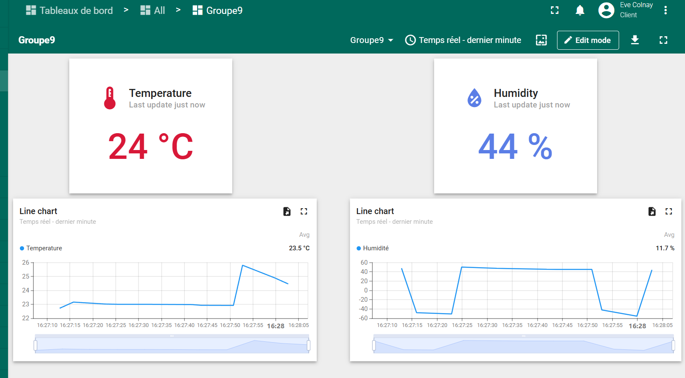

# Projet SEE – Capteurs pour l’embarqué : Station météo sans fil
<!-- ajouter lien pour dire à partir de où lire -->

Ce projet a pour objectif de concevoir une station météo sans fil capable de mesurer et de transmettre des données environnementales en temps réel à un ordinateur. Le système est développé dans le cadre du cours **Systèmes Embarqués et Capteurs (SEE)** et repose sur l’utilisation du capteur **Zest_Sensor_P-T-RH**.

---

### Description du Zest_Sensor_P-T-RH

Le **Zest_Sensor_P-T-RH** est une carte de développement électronique pour la plateforme open-source **6TRON**, intégrant trois capteurs environnementaux :
- **Capteur d’humidité HTU21DF** (TE Connectivity) : conçu pour mesurer l'humidité relative de l'air (0 ~ 100 %HR) et la température ambiante.
- **Capteur de température AS6212-AWLT-S** (AMS) : offre une résolution de 16 bits sur une plage de -40°C à +125°C, avec une fonctionnalité d'alarme pour réveiller le microcontrôleur à des seuils de température définis.
- **Capteur de pression 2SMPB-02E** (Omron Electronics) : mesure la pression atmosphérique entre 30 kPa et 110 kPa et intègre un circuit de compensation thermique pour garantir des mesures précises.

---

### Objectifs du projet

- **Utiliser le Zest_Sensor_P-T-RH** pour mesurer trois paramètres environnementaux : humidité, température et pression.
- **Transmettre les données** collectées par le capteur à un module récepteur local via une communication sans fil.
- **Afficher les données** sur THingsBoard.

---

## Pour commencer

### Pré-requis

- Un ordinateur avec Python installé pour configurer la plateforme.  
- Une installation configurée de [mbed-cli](https://os.mbed.com/docs/mbed-os/v6.15/tools/setup.html).  
- Un compte sur [ThingsBoard Cloud](https://thingsboard.cloud).

### Installation

1. **Cloner le projet dans le dossier de votre choix** :  
   ```bash
   git clone https://github.com/YazukaArashi/capteur-catie_see3.git
2. **Activer l'environnement Mbed** :
   ```bash
    source <nom_de_votre_environnement>/bin/activate
3. **Accéder au dossier du projet** :
   ```bash
    cd /chemin/vers/le/projet
4. **Compilez le programme et flashez-le sur votre carte** :
   ```bash
    mbed compile
    sixtron_flash

Le PC peut prendre un peu de temps pour compiler.

5. **Ouvrez un 2ème terminal pour lire les données transmises** :
   ```bash
    minicom -D /dev/ttyUSB0 -b 115200

### Affichage sur ThingsBoard
1. Rendez-vous sur le site ThingsBoard Cloud (https://thingsboard.cloud/login)
2. Connectez-vous à vos identifiants
3. Accédez au tableau de bord du groupe 9.
4. Les données de température et d'humidité s'afficheront dans le tableau de bord. 

### Utilisation de LoRa
Pour vérifier que la passerelle LoRa est connectée à la carte :
1. Accédez à l'onglet **Identité**.
2. Cliquez sur **Dispositif** et vérifiez que le statut est marqué comme "**actif**". 

## Résultats
Les données mesurées (température & pression) sont correctement affichées sur ThingsBoard. 



Ci-dessus, un exemple de résultats observés après avoir soufflé, voire potentiellement postilloné, sur le capteur pour faire varier les valeurs. 

### TPs du projet
TP.c : Contient l'ensemble des travaux pratiques réalisés durant le cours. 

## Notes importantes et défis rencontrés
1. **Prise en main du code LoRa** : Nous avons pris du temps pour comprendre comment utiliser le code associé à LoRa car le code ne provenait pas de nous.
2. **Problème avec la payload** : Nous avons rencontré un problème pour actualiser la payload. Afin de contourner cette difficulté, nous avons décidé de modifier directement le tableau de sortie (Tx_Buffer). Ce n'était pas la solution idéale, mais elle nous a permis de continuer à avancer.
3. **Capteur de température défectueux** : Nous avons perdu un temps considérable à cause d’un capteur de température défectueux (température). Après plusieurs tentatives infructueuses, nous avons essayé le capteur de pression, mais les valeurs obtenues n’étaient pas fiables. Finalement, nous avons opté pour le capteur d’humidité, qui, en plus de mesurer l’humidité, fournit également une mesure de température correcte.
## Auteurs
* **Angel Bossi** _alias_ [@nbossi](https://github.com/nbossi)
* **Eve Colnay--Delphin** _alias_ [@YazukaArashi](https://github.com/YazukaArashi)
* **Océane Lafitte** _alias_ [@oceanel33](https://github.com/oceanel33)


